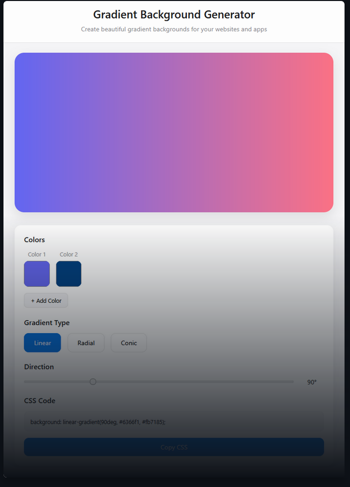

# Gradient Background Generator 🎨

A sleek, modern tool for creating beautiful gradient backgrounds for your websites and applications. This project provides an intuitive interface to generate CSS gradients with real-time preview.



## ✨ Features

- **Multiple Gradient Types**: Create linear, radial, and conic gradients
- **Multi-Color Support**: Add up to 5 colors to create complex, vibrant gradients
- **Real-Time Preview**: See your changes instantly as you adjust settings
- **Direction Control**: Fine-tune the angle of your gradients with a simple slider
- **One-Click Copy**: Get your CSS code with a single click
- **Responsive Design**: Works perfectly on desktop and mobile devices
- **Apple-Inspired UI**: Clean, minimalist interface with attention to detail

## 🚀 Live Demo

Check out the live demo: [Gradient Background Generator](https://vreemdepiesang.github.io/GradientGenerator/)

## 🛠️ Technologies Used

- HTML5
- CSS3
- Vanilla JavaScript (No frameworks or libraries)

## 🔧 Installation

1. Clone this repository:
   ```bash
   git clone https://vreemdepiesang.github.io/GradientGenerator.git
   ```

2. Navigate to the project directory:
   ```bash
   cd GradientGenerator
   ```

3. Open `index.html` in your browser or use a local development server.

## 📖 How to Use

1. **Choose Colors**: Use the color pickers to select your gradient colors
2. **Add/Remove Colors**: Click "Add Color" to include more colors (up to 5)
3. **Select Gradient Type**: Choose between Linear, Radial, or Conic gradient types
4. **Adjust Direction**: For Linear and Conic gradients, use the slider to change the angle
5. **Get the Code**: Copy the generated CSS code with the "Copy CSS" button
6. **Implement**: Paste the code into your own projects

## 💡 How It Works

The application uses vanilla JavaScript to:

1. Track user selections for colors, gradient types, and directions
2. Generate the appropriate CSS syntax based on these selections
3. Update the preview in real-time
4. Provide the correct CSS code that can be copied to the clipboard

All of this is done without any external libraries or frameworks, making it lightweight and dependency-free.

## 🔮 Future Improvements

- Save gradients to local storage
- Export gradients as images
- Preset gradient library
- Custom color stop positions
- More gradient types and patterns

## 📝 License

This project is open source and available under the [MIT License](LICENSE).

## 👨‍💻 Created By

Created as part of my learning journey in full-stack web development.

---

Feel free to contribute to this project by opening issues or submitting pull requests!
